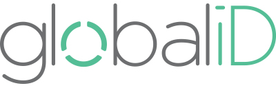
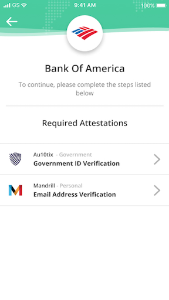
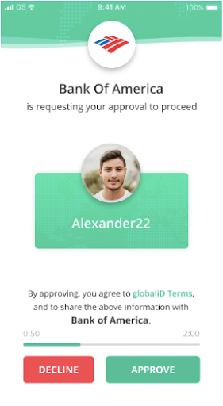

# globaliDConnect
Seamless, secure and trusted user onboarding and login

[Overview](#overview)
&nbsp;&nbsp;&nbsp;&nbsp;[Web/Mobile Support](#webmobile-support)
&nbsp;&nbsp;&nbsp;&nbsp;[Attestation Requirements](#attestation-requirements)
[Getting Started](#getting-started)
&nbsp;&nbsp;&nbsp;&nbsp;[Redirect URL](#redirect-url)
&nbsp;&nbsp;&nbsp;&nbsp;[Attestation Consent Request Configuration (ACRC)](#attestation-consent-request-configuration-acrc)
[Specifications](#specifications)
&nbsp;&nbsp;&nbsp;&nbsp;[URL Format](#url-format)
&nbsp;&nbsp;&nbsp;&nbsp;[URI Parameters](#uri-parameters)
&nbsp;&nbsp;&nbsp;&nbsp;[Response Handling](#response-handling)

## Overview

globaliDConnect is an OAuth2 protocol that mediates between your application and a user’s identity. It securely communicates your requirements for access, ensures that the user fulfils such requirements before permitting access, and allows users to explicitly consent to share personal data with you. Using globaliDConnect, users experience smooth, near-instant onboard or log in to your service by scanning a web QR code or by tapping a button on mobile.

globaliDConnect is a lightweight solution with heavyweight benefits, including:

 * A complete onboarding solution that allows you to focus your on building your product instead of on data collection and compliance.
    
 * Fortifying your solution against hackers by doing away with usernames and passwords, thereby eliminating a common point of entry.
    
 * Protecting against fraud by permitting entry only to users who have successfully obtained the required attestations from the attesting agencies you trust.
    
 * A secure and seamless one-touch login experience that delights users and reduces friction to access.

### Web/Mobile Support

On web, globaliDConnect displays a QR code that the user may scan to onboard or to log in. When opening globaliDConnect on mobile, the QR code is hidden, instead displaying a button to open the globaliD App, as well as links to download the globaliD App from the Play or App stores.

### Attestation Requirements

globaliDConnect allows you to customize the specific attestations required for users to access your services. You may define the types of personal data that you will require users to attest, as well as the attesting agencies and freshness of any attestations that you will accept.

When users onboard through globaliDConnect, the globaliD App will guide them through the process of requesting any required attestations that they do not yet have attached to their globaliD Names, as shown in the first image below. If they already have attestations that conform to your requirements, the user will simply be asked to consent to share their attestations with you, as shown in the second image below.

| User does not yet have the required attestations | User already has the required attestations |
| ------------------ | ------------------ |
|  |  |

## Getting Started

The [specifications](#specifications) below are provided for your information. Once you’re ready to get started, please email us at [hello@global.id](mailto:hello@global.id) with the following information:

-   [Redirect URL](https://docs.google.com/document/d/1H3mJmgwgvGmzJZWCqZZvTkcH5pj96HkGwta6PLRNJHo/edit#heading=h.q86ztdt1gqy)
    
-   [Attestation Consent Request Configuration (ACRC)](https://docs.google.com/document/d/1H3mJmgwgvGmzJZWCqZZvTkcH5pj96HkGwta6PLRNJHo/edit#heading=h.ro16ehbxwxm5)  if you would like to limit access to users who have attested specific information
    

  

Once we receive, review and approve this information, we will provide you with a client_id, client_secret, and acrc_id, which you may use to load the globaliDConnect authentication client and obtain access tokens or authorization codes. We will send these to you via email in a password-protected encrypted archive.

## Redirect URL

This is the redirect URL to which users will be returned following successful onboarding or login. It should be in HTTPS format. You may provide multiple URLs (e.g. to different environments) if you wish. We will provide a unique client_id and client_secret for each environment.
<!--stackedit_data:
eyJoaXN0b3J5IjpbLTEwMzQzNjYyMTYsMTU0MTU5MDAsLTIwOD
g3NDY2MTJdfQ==
-->